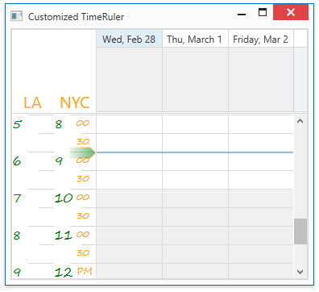

<!-- default badges list -->

<!-- default badges end -->

# WPF Scheduler - Use Styles and Templates to Customize Time Rulers

This example applies custom styles to the following [Time Ruler](https://docs.devexpress.com/WPF/404183/controls-and-libraries/scheduler/visual-elements/time-ruler) elements:

* [TimeRulerHeaderControl](https://docs.devexpress.com/WPF/DevExpress.Xpf.Scheduling.Visual.TimeRulerHeaderControl)
* [TimeRulerCellControl](https://docs.devexpress.com/WPF/DevExpress.Xpf.Scheduling.Visual.TimeRulerCellControl)
* [TimeRulerCellHourPresenter](https://docs.devexpress.com/WPF/DevExpress.Xpf.Scheduling.Visual.TimeRulerCellHourPresenter)
* [TimeRulerCellMinutePresenter](https://docs.devexpress.com/WPF/DevExpress.Xpf.Scheduling.Visual.TimeRulerCellMinutePresenter)
* [TimeMarkerControl](https://docs.devexpress.com/WPF/DevExpress.Xpf.Scheduling.Visual.TimeMarkerControl)

The [DayViewBase.TimeRulerCellStyle](https://docs.devexpress.com/WPF/DevExpress.Xpf.Scheduling.DayViewBase.TimeRulerCellStyle) property applies specified styles to scheduler views.

## Files to Review

* [MainWindow.xaml](./CS/SchedulerCustomizeTimeRulerExample/MainWindow.xaml)
* [MainWindow.xaml.cs](./CS/SchedulerCustomizeTimeRulerExample/MainWindow.xaml.cs) (VB: [MainWindow.xaml.vb](./VB/SchedulerCustomizeTimeRulerExample/MainWindow.xaml.vb))

## Documentation

* [Time Ruler](https://docs.devexpress.com/WPF/404183/controls-and-libraries/scheduler/visual-elements/time-ruler)
* [TimeRuler](https://docs.devexpress.com/WPF/DevExpress.Xpf.Scheduling.TimeRuler)

## More Examples

* [WPF Scheduler - Add Multiple Time Rulers and Adjust Their Settings](https://github.com/DevExpress-Examples/how-to-add-multiple-time-rulers-to-the-scheduler-and-adjust-their-settings-t587066)
